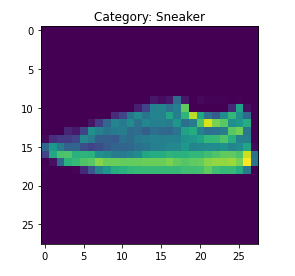
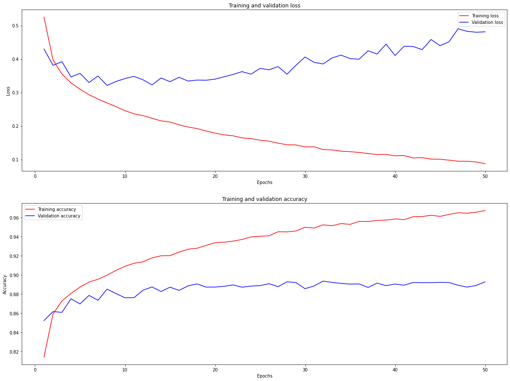
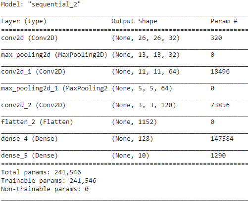
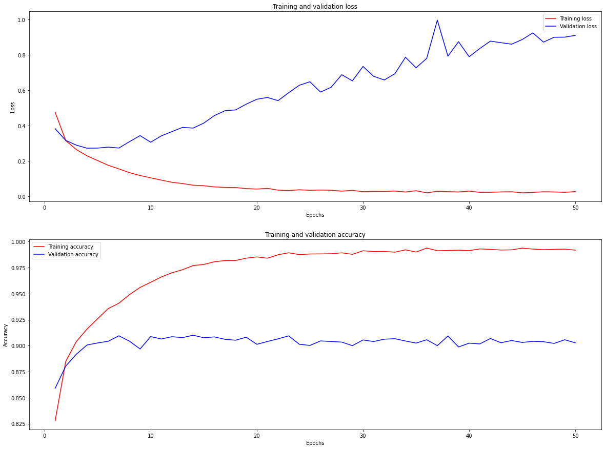
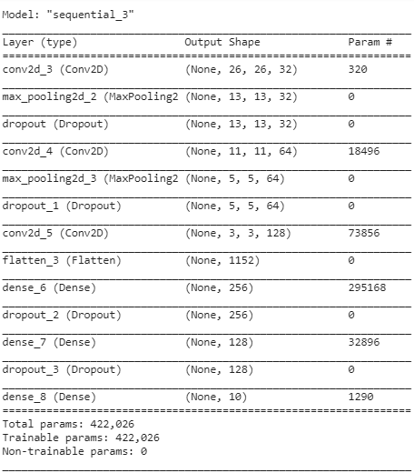

# simple-fashion-mnist

# Bài toán 

Bài toán Nhận diện ảnh thời trang với dữ liệu sử dụng là Fashion MNIST.

*   Input: Một ảnh grayscale với kích thước 28x28 thể hiện hình ảnh của 1 loại trang phục thời trang.

*   Output: Kết quả phân loại của bức ảnh input thuộc 1 trong 10 loại bao gồm: T-shirt/top, Trouser, Pullover, Dress, Coat, Sandal, Shirt, Sneaker, Bag, Ankle Boot



# Hướng giải quyết

Hướng giải quyết cho bài toán mình đề xuất là sử dụng các mạng neural network, tương tự như các hướng giải quyết cho bài toán MNIST (phân loại chữ số viết tay).

Với hướng ban đầu là sử dụng các mạng Neural Network đơn giản là MLP (multi-layer perceptron), tiếp theo là sử dụng các cấu trúc CNN để trích xuất đặc trưng.

>   Ngoài ra mình cũng sử dụng các kĩ thuật Regularization để giải quyết các mô hình bị overfitting.

# Chọn mô hình tối ưu

Mình lựa chọn mô hình theo hướng đi từ mô hình đơn giản -> mô hình phức tạp để tối ưu hóa khả năng mô hình học được.

Khi các mô hình bị overfitting thì sẽ áp dụng các phương pháp như Regularization hay Dropout để hạn chế vấn đề này.

1.  Với mô hình Neural network đơn giản

Với mô hình đơn giản nhất là một mạng shallow neural network như sau: Input -> Dense 128 unit -> Output


Kết quả của mô hình này khá tốt, nhưng vấn đề hiện tại nó đang bị overfitting.



2.  Mô hình CNN

Mô hình sử dụng CNN để trích xuất các đặc trưng mình đề xuất như sau.



Mô hình hiện cũng bị overfitting, nhưng độ lỗi và độ chính xác khi sử dụng CNN trích xuất đặc trưng là tốt hơn hẳn so với mô hình (1).



3.  Giải quyết vấn đề overfitting với L2 Regularization và Dropout


# Kết quả

Kết quả của mô hình tốt nhất sau quá trình tìm kiếm mô hình được lưu ở trong file model.h5.



Sử dụng đoạn code sau để load model:

```
best_model = tf.keras.models.load_model('model.h5')

[test_loss, test_acc] = best_model.evaluate(X_test, test_label)

print("Loss score in Test set {}".format(test_loss))
print("Accuracy in Test set {}".format(test_acc))
```

Kết quả với test set là: Độ lỗi 0.24, Độ chính xác 91.35%